---
hide:
  - navigation
---

# General
## How to use SQL Connect?
### SQL Connect Screen
Once you login successfully to SQL Connect, you will see a screen like this showing SQL Account/ SQL Payroll. You can interact with this display just as you would in your normal desktop. Your mouse and keyboard will function as if they were connected directly to the remote machine.

---
### SQL Connect Menu
To facilitate your works in SQL Connect, we provide a menu containing variety of functions. In order to access the menu, click on the button (circled in red).

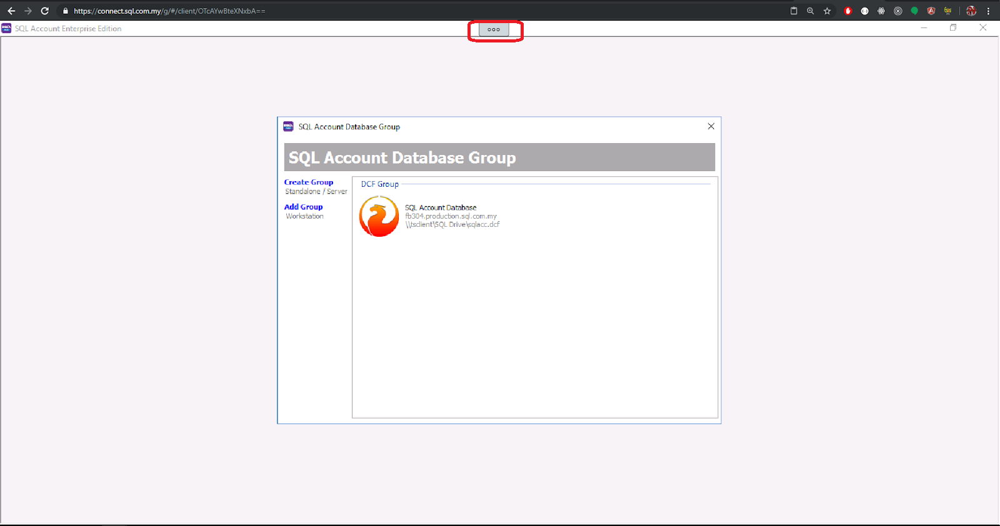

After clicking on the button, the menu will be open and you will see the screen below.

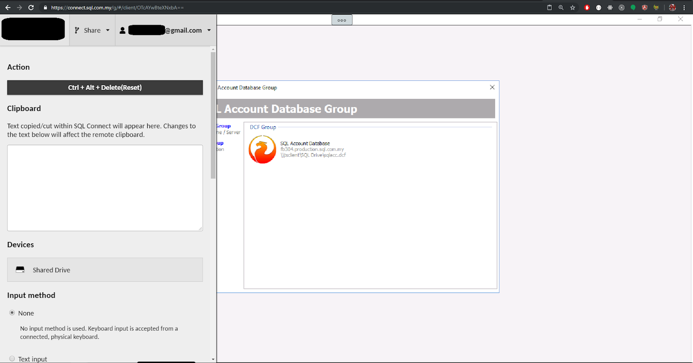

With the menu, you can:

- Disconnect / Logout from SQL Connect
- Copying / Pasting Text
- Uploading / Downloading files
- Zooming In and Out (Scale Display)
- Changing Input Method

---
#### Logout 
When you want to quit SQL Connect, kindly use this method. Another way to close completely is by closing the SQL Account/ SQL Payroll application. Click below button available in the menu:

After click the above button, click "Sign out" on the following screen:

This method will sign you out from SQL Connect session properly.

---
#### Copy / Paste
You can find a clipboard in the menu as shown below:

Text cut / copied will be shown here. This is for users who have their clipboard not functioning well. Normally, you can copy/paste text directly. 

For **Google Chrome** / **Chromium Edge** users, make sure clipboard permission is **allowed**. It definitely save you a lot of time.

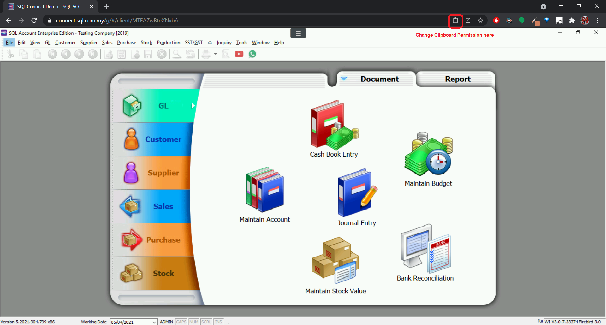

For **Mozilla Firefox** users who can't get their clipboard working, you may refer to the troubleshooting steps available below:

[Troubleshooting: Firefox Clipboard Issue](troubleshooting.md#firefox-clipboard-issue)

---
#### File Transfer (Upload / Download)
User can transfer files between SQL Connect and their local PC with **Shared Drive**. It can be accessed by clicking "**Shared Drive**" in the menu.

#####  Upload
Files can be transferred to SQL Connect by dragging and dropping the files into your browser window, or by clicking at the "Upload Files" button. 

The state of all file uploads can be observed in the notification dialog at the bottom right once an upload begins, and can be cleared once completed by clicking the "Clear" button. Downloads are tracked through your browser's own download notification system.

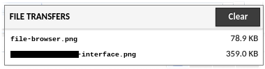

Files uploaded can be accessed via "**SQL Drive on SQL Connect**"

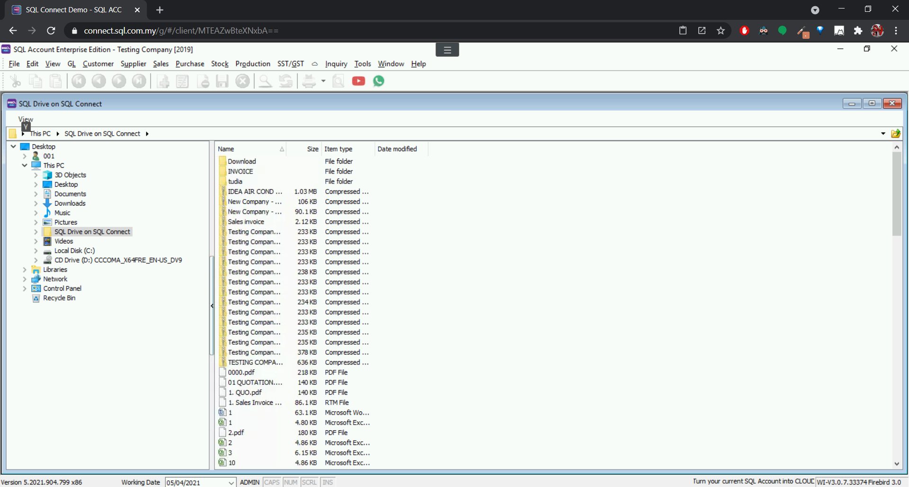

##### Download
Files can be downloaded by double click on the file you wish to download in the **Shared Drive** interface. 

If you wish to download file from SQL Connect to your local (and the file is not exist in **Shared Drive**), you can save it in the "**Download**" folder in "**SQL Drive on SQL Connect**". It will then trigger a file download action.

---
#### Zoom In / Zoom Out (Scaling Display)
By default, SQL Connect will adjust perfectly according to your pc screen resolution. However, if you wish to change the zoom level, you can change it in the menu.

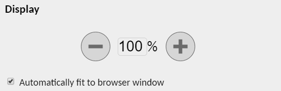

---
#### Changing Input Method
When using SQL Connect in phone/tablet, users may change the input method from "**None**" to "**Text Input**". With this, users is able to use virtual keyboard.

---
### Backup / Restore Database
For database **backup**, you can backup it as usual. (In public cloud, we protect users' data by performing backup twice a day). If you wish to download a database backup to you local PC, you may follow the steps in [Download](#download) section.

For database **restore**, the process is different for public and private cloud. For **public cloud**, you can't do the restoration from the web browser. We have purposely lock it to ensure the safety of users' data. You may need to contact our support with your database backup, and your database will be restored in no time.

For **private cloud**, user can restore database directly in their server. You can perform restoration just like how you do it in the local. 

---
### Copy Image into Rich Text Editor
- Firstly, upload the image file to SQL Connect (via **SQL Drive**)
- In SQL Account / SQL Payroll, go to `View > File Explorer`
- Navigate to `This PC > SQL Drive on SQL Connect > double click to open your image file`
- Select All (or press `Ctrl + A`), and then copy it.
- Go to the rich text editor, paste the image you just copy.

---
### Delete Files in SQL Drive
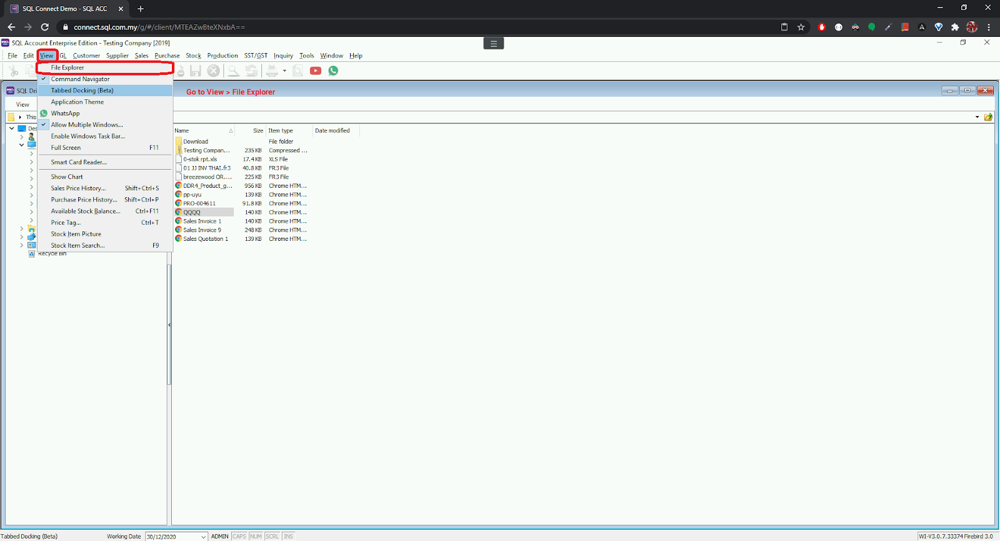

---
### Printing Half Page

- Add paper size.

- Add another printer as norm for **Half Page**.

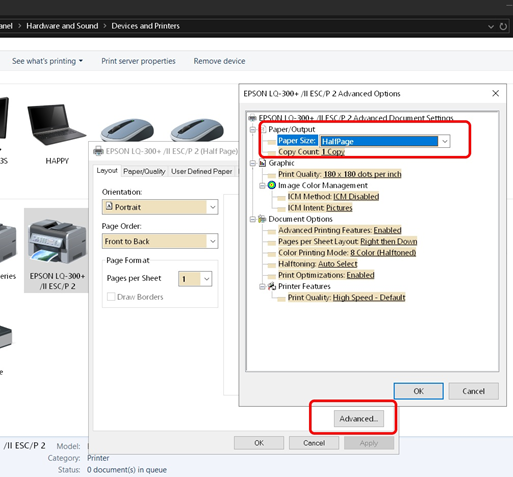

- Set default paper size.

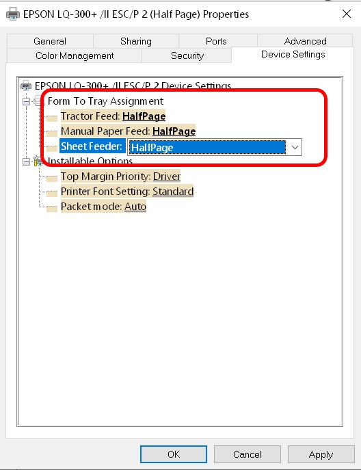

- Once you have done with the above settings, login into your SQL Connect session and test print with the following steps:

---
### Saving PDF
If you want to download PDF file, save it to the "**Download**" folder in the "**SQL Drive on SQL Connect**"

It will then trigger the browser print window:

Usually, you will select your local printer here. WAIT!!!! You want to save a pdf, so change it to "**Save as PDF**".

---
### Signout (Private Cloud only)
**The is exclusive for private cloud users only.** In private cloud, the user has control over the server. Thus, the admin has the right to signout connections.

---
### SQL Connect Printing
In SQL Connect, we have two groups of users (Public cloud users & private cloud users). As a private cloud users, you can print directly to your local printer as long as the printer is accessible from your server. In public, the only option you have is to use the "**SQL Connect Printer**" and then forward to your local printer.

By using "**SQL Connect Printer**", you will then able to access the browser print dialog which has the right to utilize your local printer. From there, you can select the printer you want, size you like and so on and finally click print. Below is an example of chrome print dialog:

---
#### Alternative to SQL Connect Printer

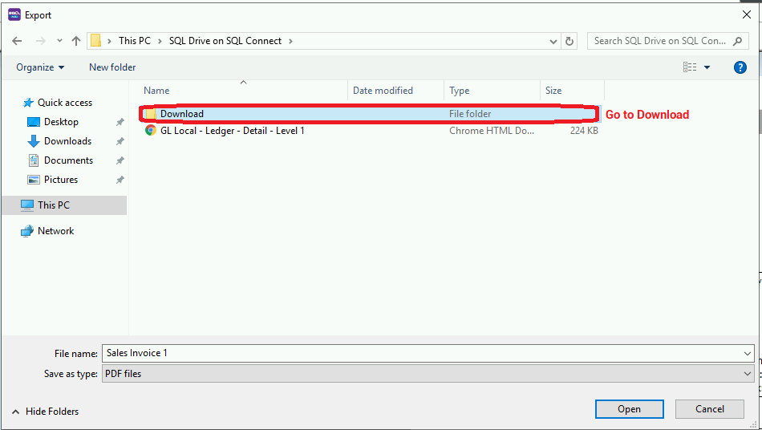
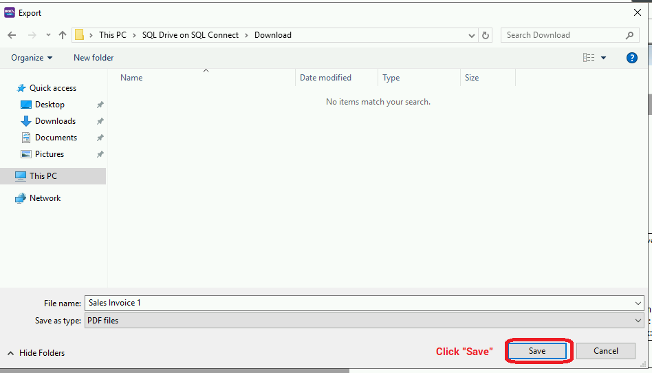

---
### SQL Utilities
To add SQL Utilities, follow the steps below:

1. Go to `File > Run > Configure Program...`
2. Add the utilities software from here: `C:\eStream\Utilities`
3. After add successfully, the program should be available at `File > Run > ...`

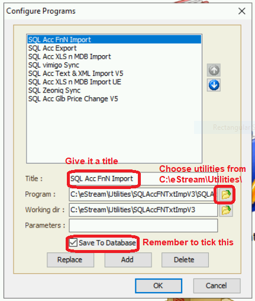
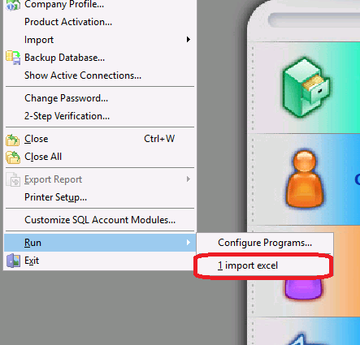
