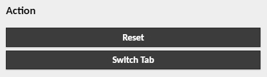
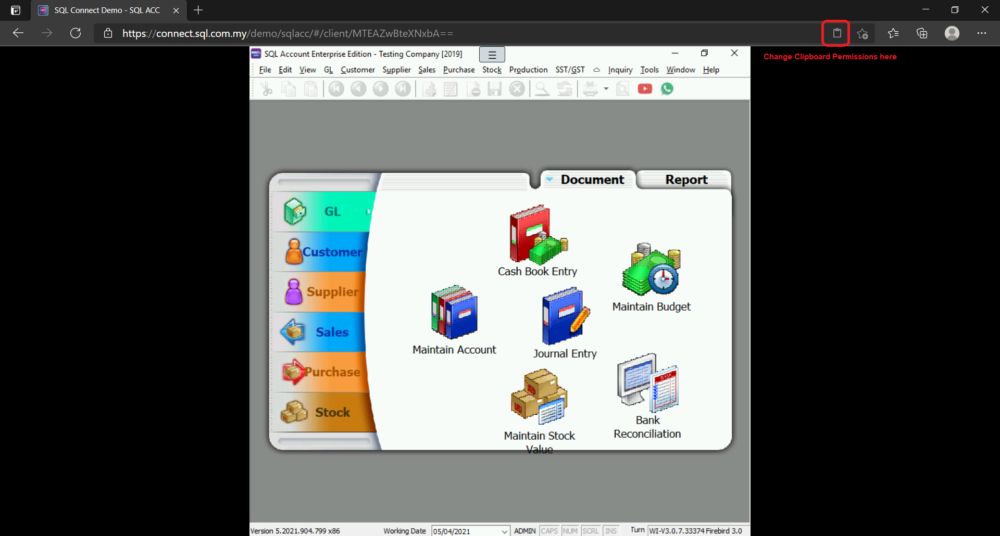

# Basic

## SQL Connect Screen

Once you login successfully to SQL Connect, you will see a screen like this showing SQL Account/SQL Payroll. You can interact with this display just as you would in your normal desktop. Your mouse and keyboard will function as if they were connected directly to the remote machine.

---

## SQL Connect Menu

To facilitate your works in SQL Connect, we provide a menu containing variety of functions. In order to access the menu, click on the button (circled in red).

After clicking on the button, the menu will be open and you will see the screen below.

With the menu, you can:

- [Logout from SQL Connect](#logout-reset)
- [Switch Tab](#switch-tab)
- [Copying / Pasting Text](#copy--paste)
- [Uploading / Downloading files](#file-transfer-upload--download)
- [Zooming In and Out (Scale Display)](#zoom-in--zoom-out-scaling-display)
- [Changing Input Method](#changing-input-method)

---

## Logout (Reset)

When you want to quit SQL Connect or reset the session, kindly use this method. Another way to close completely is by closing the SQL Account/ SQL Payroll application. Click the "**Reset**" button available in the menu:

After click the above button, click "**Sign out**" on the following screen:

This method will sign you out from SQL Connect session properly.

---

## Switch Tab

This feature is useful when you have SQL Utility open and wish to switch back to SQL Account. Simply click on the **Switch Tab** button.

---

## Copy / Paste

You can find a clipboard in the menu as shown below:

Text cut / copied will be shown here. This is for users who have their clipboard not functioning well. Normally, you can copy/paste text directly.

For **Google Chrome** / **Chromium Edge** users, make sure clipboard permission is **allowed**. It definitely save you a lot of time.

For **Mozilla Firefox** users who can't get their clipboard working, you may refer to the troubleshooting steps available below:

[Troubleshooting: Firefox Clipboard Issue](../troubleshooting/browser-issues#copy--paste)

---

## File Transfer (Upload / Download)

User can transfer files between SQL Connect and their local PC with **Shared Drive**. It can be accessed by clicking "**Shared Drive**" in the menu.

### Upload

Files can be transferred to SQL Connect by dragging and dropping the files into your browser window, or by clicking at the "Upload Files" button.

The state of all file uploads can be observed in the notification dialog at the bottom right once an upload begins, and can be cleared once completed by clicking the "Clear" button. Downloads are tracked through your browser's own download notification system.

Files uploaded can be accessed via "**SQL Drive on SQL Connect**"

### Download

Files can be downloaded by double click on the file you wish to download in the **Shared Drive** interface.

If you wish to download file from SQL Connect to your local (and the file is not exist in **Shared Drive**), you can save it in the "**Download**" folder in "**SQL Drive on SQL Connect**". It will then trigger a file download action.

---

## Zoom In / Zoom Out (Scaling Display)

By default, SQL Connect will adjust perfectly according to your pc screen resolution. However, if you wish to change the zoom level, you can change it in the menu.

---

## Changing Input Method

When using SQL Connect in **phone/tablet**, users may change the input method from "**None**" to "**Text Input**". With this, users is able to use virtual keyboard.

---

## Install SQL Connect as an App

When using SQL Connect as an App, you get thin browser tab and able to use SQL Connect in better resolution. Refer to the following steps on how to do it.

1. Visit [connect.sql.com.my](https://connect.sql.com.my) / [private.sql.com.my](https://private.sql.com.my).

2. Click on the button located at the end of address bar.

3. Confirm the installation.

4. The installation will create a shortcut in the desktop. (You can pin it to your taskbar for easy access)

