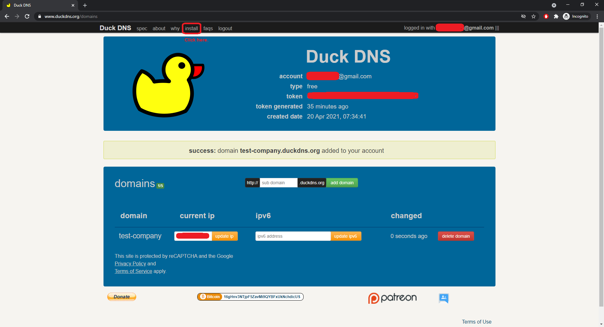

# DDNS

Get a free DDNS from Duckdns if you don't have one.

## Steps
1. If you don't have a DDNS, you may get one free from **DuckDNS**.
2. Firstly, visit [Duck DNS](https://www.duckdns.org/).
    
3. Next, sign in using your gmail.
    
4. Once you have sign in, you will reach the following page.
5. Create a DDNS that you like.
    
6. You will end up with a screen similar to the one below. Next, click on **install**.
    
7. Select `windows-gui`, and choose the DDNS you created just now.
    
8. A guide will be shown similar to the screen below. Follow the steps.
    
9. Lastly, write the ddns you just created in the [checklist](https://docs.google.com/spreadsheets/d/1iqCgQMDHGcTYtt0HSgAsEAPTED1eltnQj8ywJdwYYx0/edit?usp=sharing) prepared. (Ex. `test-company.duckdns.org`)