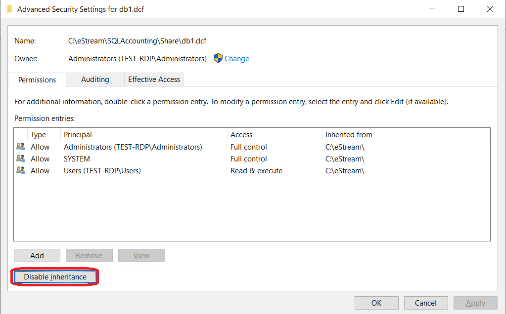
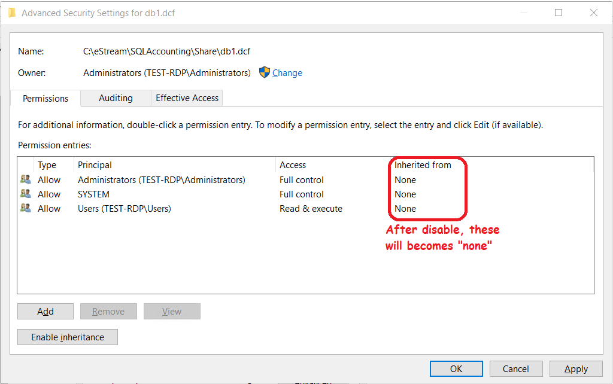
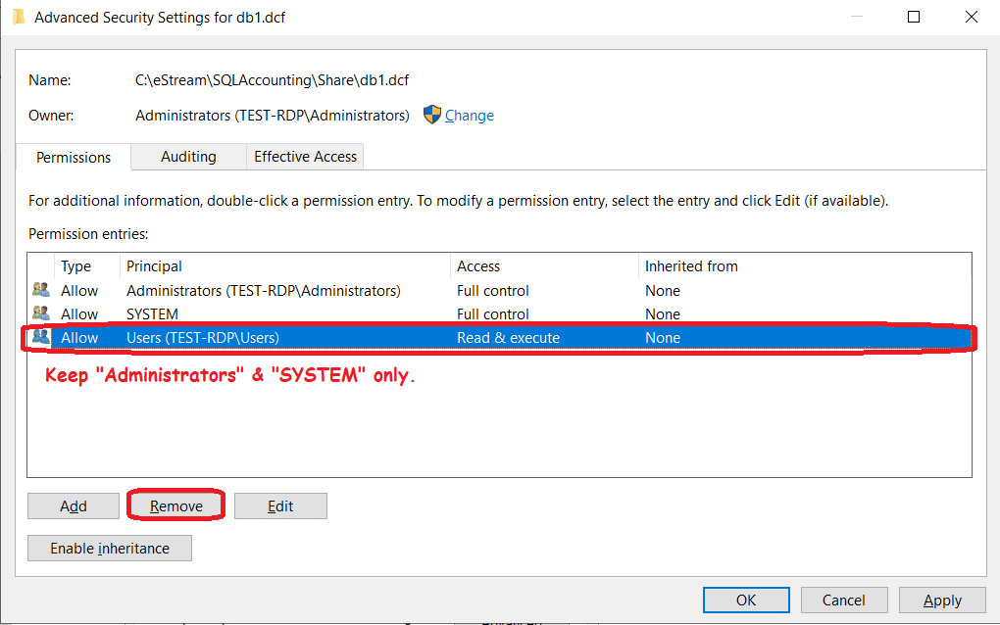
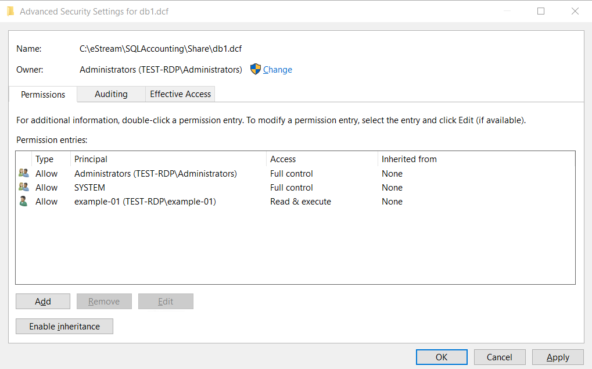

import ReactPlayer from "react-player";

# Windows User Access Rights

This tutorial will guide you through the steps on how to limit users' access to only certain database groups for Private Cloud.
Both video & text tutorials are available.

:::note
If you are unsure of which window user the emails have access to, feel free to call our support to get the **email:windows** user mapping.
:::

## Video

Video tutorial here:

<ReactPlayer controls url="https://youtu.be/H78QOIUPd7k" />

## Tutorial

### Prerequisite: Retrieve Windows Users

1. Search `Computer Management`.
   
2. Click `Local Users and Groups > Users`. (Look for username with your company name, those are the users created for SQL Connect - private)
   

### Case Study

#### Environment

1. Two emails registered.
   - example1@gmail.com (has access to windows user example-01)
   - example2@gmail.com (has access to windows user example-02)
2. Two databases in the server.
   - db1
   - db2

#### Assumptions

1. example1@gmail.com can only access to db1.
2. example2@gmail.com can only access to db2.

#### Solutions

- Create two dcf file. (`db1.dcf` has link to db1, `db2.dcf` has link to db2)

- Right click on `db1.dcf`, select `Properties`.

- Go to `Security`, select `Advanced`.

- Click `Disable Inheritance`. (If the button shows `Enable Inheritance`, you may skip this step)

- Remove principal except `Administrators` and `SYSTEM`.

- Next, click `Add`, click `Select a Principal`.

- Search for the windows username you wish. In this case we will search for `example-01`. (Click `Check Names` after key in window username)

- Configure the permission to `Read` and `Read & execute` only, select `OK`.

- Repeat the `Add` procedure if you want more users to use this dcf. Press `Apply` and `OK` if there is no more.

- Repeat **step 2** to **step 9** for `db2.dcf`.
