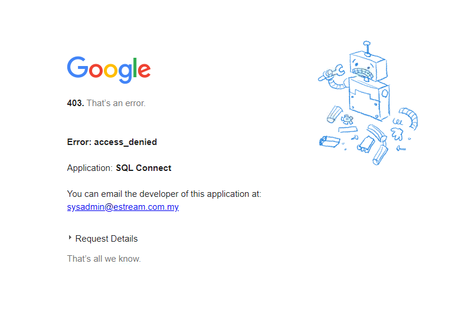
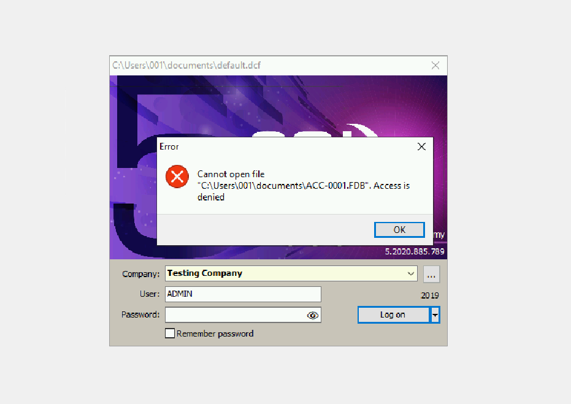
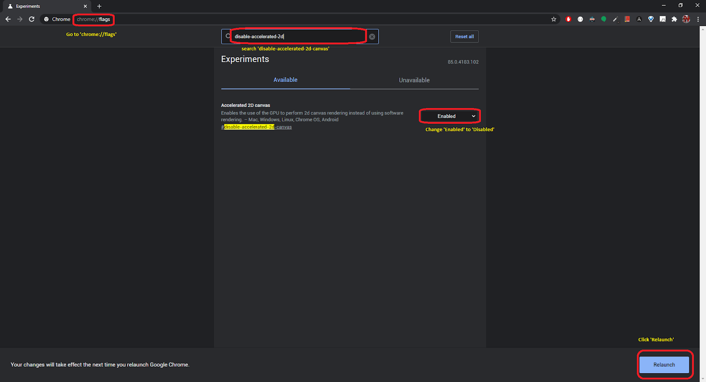
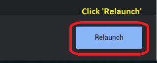
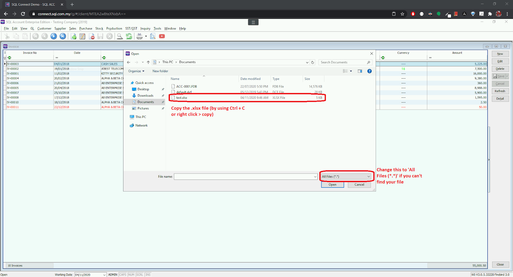

---
hide:
  - navigation
---
# Troubleshooting
## Frequently Asked Question (FAQ)
### Add / Change Email
- For any changes to the emails, kindly contact your dealer or our support team.

---
### Browser supported
- ***Google Chrome*** is recommended after all. Besides, SQL Connect supports Mozilla Firefox, Chromium Edge, Safari and Opera. Stone age browser like Old Edge and Internet Explorer are not supported. (You may face issues in certain features.)

--- 
### Error: "There is no default printer selected"
- When you face this error, you will need to signout and reconnect again. Follow the steps: [Signout](general.md#signout)

---
### How to update SQL Account / SQL Payroll version for my SQL Connect?
- For **public cloud** users, kindly contact your dealer or our support team to have your software update.
- For **private cloud** users, you can either upgrade it directly in your server or seek for assistance from our skillful support team.

---
### My local files are not visible in SQL Connect
- By nature, you will need to upload your files if you want to use them in SQL Connect. You may check this out. [Upload Files](general.md#upload)

---
### In private cloud, there is an user named "Administrator", can I have the password for that account?
- I am sorry but in normal circumstances, this account is activated by us and is used to maintain the server. The account will be protected by random alphanumeric characters which is impossible to memorize. For operation which requires admin privileges, you may use your local user. It has the same administrative rights.

---
### Use phone / tablet keyboard
- Yes, it is possible. Kindly follow the instruction listed here to switch the input. [Changing Input Method](general.md#changing-input-method)

---
## Login Error
### Google Error

- if you see errors like above, you will have to check your email's **date of birth**. Google classifies email which has an age less than **18 years old as child**. With a child email, you are **forbidden** from entering many websites available in the web including our SQL Connect services. 
- Besides, make sure no **Family Link** email is used.     

---
### Empty Homepage

- If you see the above screen, it indicates that your account is not activated yet. Kindly contact your dealer or our support team for further checking. 

---
## "Access Denied" when login SQL Account / SQL Payroll

- **THIS HAPPENS IN PRIVATE CLOUD ONLY.**

- If you face the above error, kindly change the "*Database Engine*" in `.dcf` file from **Firebird Standalone Database** to **Firebird Server**. 

---
## Black / Blank Screen
- When you face this, it indicates that your sessions is not signout completely. Kindly [signout](general.md#logout) and then reconnect again. You should be seeing your screen back to normal.

---
## Blur Font 
- **THIS ISSUE IS RELATED TO GOOGLE CHROME ONLY.**

---
## Corrupted Excel File Issue (Temp Solution)
- **THIS ISSUE INVOLVES BOTH .xlsx & .xls EXCEL FORMAT. **
- This issue has been resolved since SQL Account (5.2021.900.797) & SQL Payroll (1.2021.195.165). 
- If you still face this issue, kindly contact our support team.

---
## Copy & Paste Issue
- **THIS ISSUE IS RELATED TO FIREFOX ONLY**

--- 
## Mouse Missing, Black Box around Mouse, Empty Page print using SQL Connect Printer Solutions
- **THIS ISSUE HAS BEEN RESOLVED ACCORDING TO MICROSOFT. KINDLY UPGRADE YOUR WINDOWS TO THE LATEST VERSION TO PREVENT THIS.**
- These issues are all related and caused by Windows Updates. As far as we researched, it happens in chromium based web browsers only (Google Chrome, Opera, Chromium Edge).

- [Microsoft Official Statement](https://support.microsoft.com/en-us/topic/march-15-2021-kb5001567-os-builds-19041-868-and-19042-868-out-of-band-6e0844a2-7551-4b2d-9c4b-4274a5949bf3)

- Summary:

---
## Windows 7 Certificate Issue
1. Download [ISRG-ROOT-X1](https://drive.google.com/file/d/1PfNzAVrlSGHNQrd3kOyfx3HvH3Jal-X8/view?usp=sharing)
2. Double click on the file, you will see the windows below.

	
3. Install the certificate. Select the second option, click `Browse`.

4. Select `Trusted Root Certificate Authorities`.

5. Reboot PC.