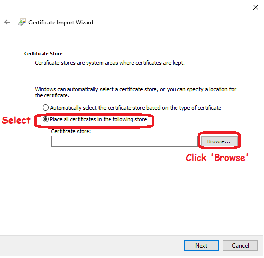

---
hide:
  - navigation
---
# Troubleshooting
## Common Errors
### There is no default printer selected
- Do a reset on the user session: [Reset Session](general.md#signout)

---
### Sign in error

- if you see errors like above, you will have to check your email's **date of birth**. Google classifies email which has an age less than **18 years old as child**. With a child email, you are **forbidden** from entering many websites available in the web including our SQL Connect services. 
- Besides, make sure no **Family Link** email is used.     

---
### Empty Homepage

- If you see the above screen, it indicates that your account is not activated yet. Kindly contact your dealer or our support team for further checking. 

---
### Private Cloud: "Access Denied" when login SQL Account / SQL Payroll

- **THIS HAPPENS IN PRIVATE CLOUD ONLY.**

- If you face the above error, kindly change the "*Database Engine*" in `.dcf` file from **Firebird Standalone Database** to **Firebird Server**. 

---
### Black / Blank Screen
- Perform session reset following the steps: [Reset Session](general.md#logout)

---
### Windows 7 Certificate Issue
1. Download the certificate from [ISRG-ROOT-X1](https://x1.i.lencr.org).
2. Run the certificate file, you will see a windows as below.

	
3. Install the certificate. Select the second option, click `Browse`.

4. Select `Trusted Root Certificate Authorities`.

5. Reboot PC.

---
### Windows 10 Certificate Issue
1. Update to latest Windows 10.

2. Download the certificate from [ISRG-ROOT-X1](https://x1.i.lencr.org).
3. Run the certificate file, you will see a windows as below

4. Install the certificate on Local Machine. 

5. Select the second option, click `Browse`.

6. Select `Trusted Root Certificate Authorities`.

7. Reboot PC.

---
## Browser Related Issues
### Google Chrome: Blur Font 
- **THIS ISSUE IS RELATED TO GOOGLE CHROME ONLY.**

---
### Google Chrome: Fail to Print/Download PDF
- **THIS ISSUE IS RELATED TO GOOGLE CHROME ONLY.**

---
### Mozilla Firefox: Copy & Paste
- **THIS ISSUE IS RELATED TO FIREFOX ONLY**

---
## Past Issues & Solutions
### Corrupted Excel File Issue (Temp Solution)
- **THIS ISSUE INVOLVES BOTH .xlsx & .xls EXCEL FORMAT. **
- This issue has been resolved since SQL Account (5.2021.900.797) & SQL Payroll (1.2021.195.165). 
- If you still face this issue, kindly contact our support team.

---
### Mouse Missing, Black Box around Mouse, Empty Page print using SQL Connect Printer Solutions
- **THIS ISSUE HAS BEEN RESOLVED ACCORDING TO MICROSOFT. KINDLY UPGRADE YOUR WINDOWS TO THE LATEST VERSION TO PREVENT THIS.**
- These issues are all related and caused by Windows Updates. As far as we researched, it happens in chromium based web browsers only (Google Chrome, Opera, Chromium Edge).

- [Microsoft Official Statement](https://support.microsoft.com/en-us/topic/march-15-2021-kb5001567-os-builds-19041-868-and-19042-868-out-of-band-6e0844a2-7551-4b2d-9c4b-4274a5949bf3)

- Summary:

---
