# Browser Related Issues

Solutions to fix some browser related issues.

---

## Copy & Paste Not Working

- Clipboard permission is blocked, follow steps below to enable.

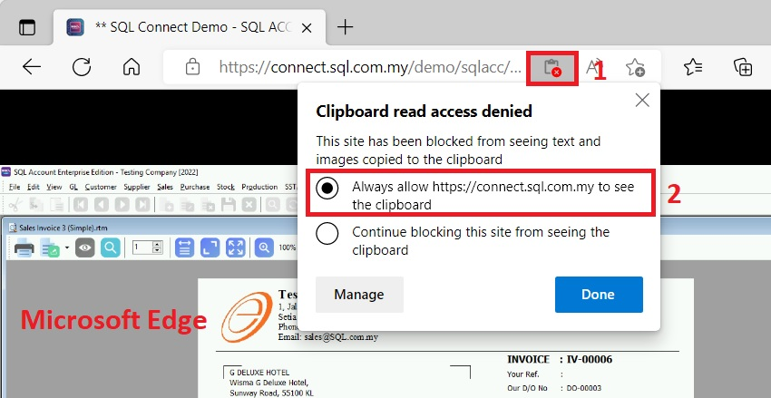

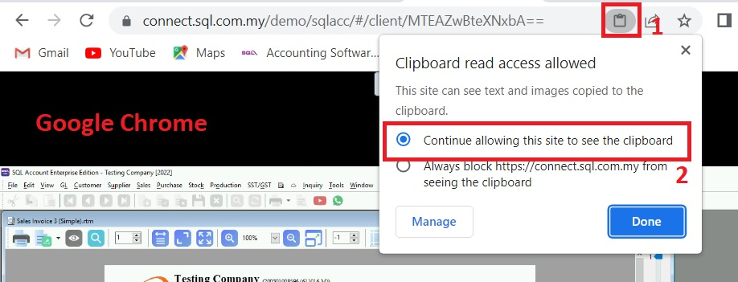

## Google Chrome

### Blur Font

:::note
This issue is related to Google Chrome only.
:::

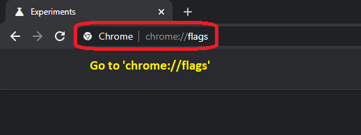
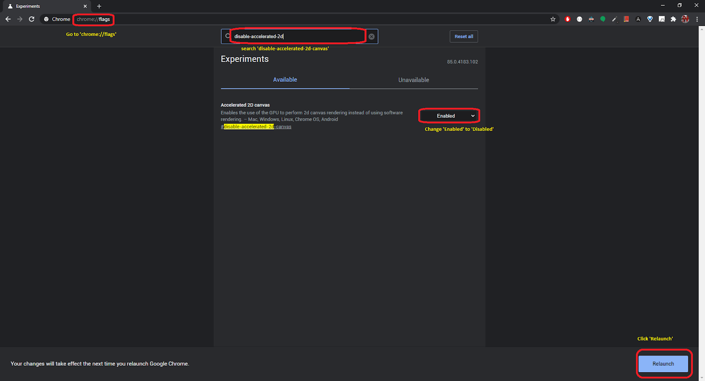
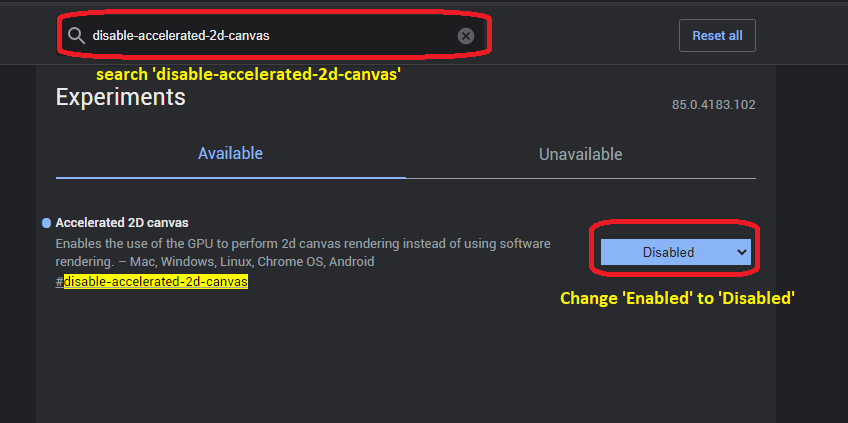

### Fail to Print/Download PDF

:::note
This issue is related to Google Chrome only.
:::note

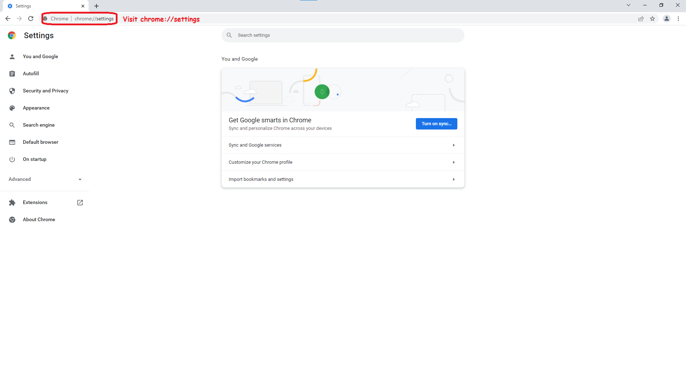

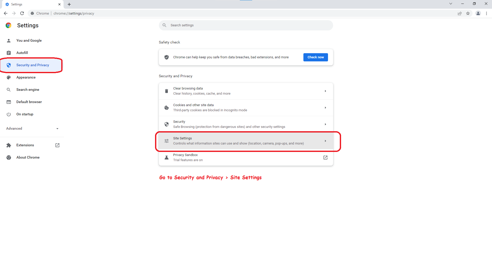

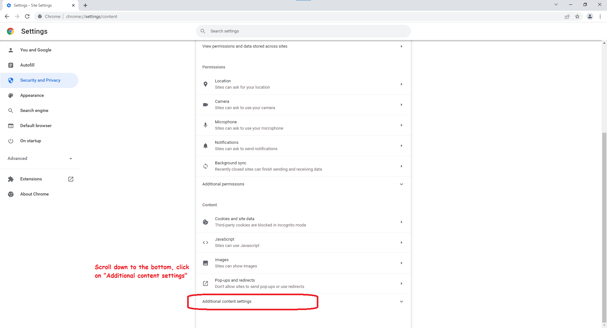

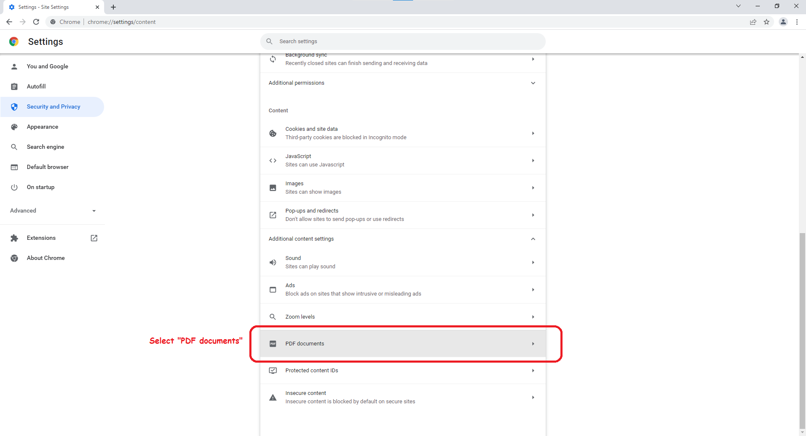

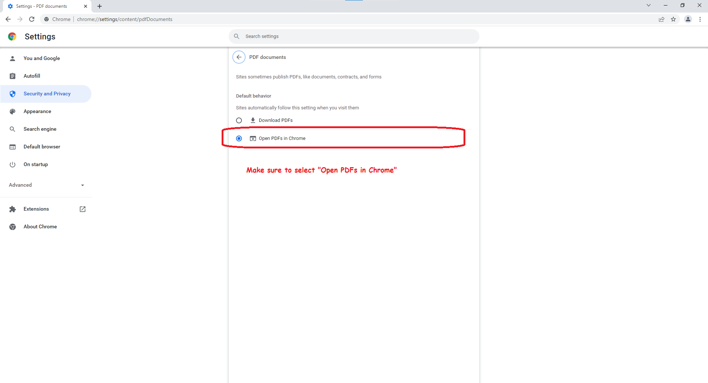

---

## Mozilla Firefox

### Local Printer Options not pop up

:::note
This issue is related to Mozilla Firefox only.
:::note

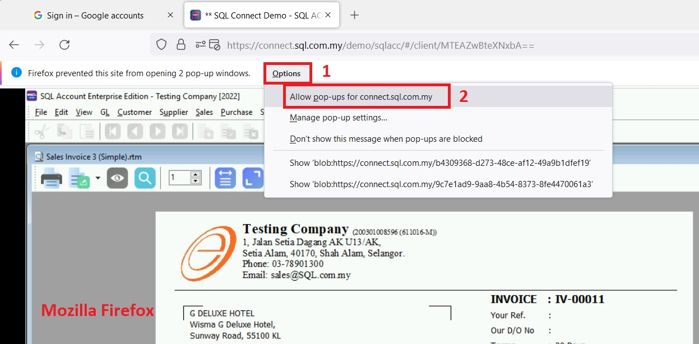

### Copy & Paste

:::note
This issue is related to Mozilla Firefox only.
:::note

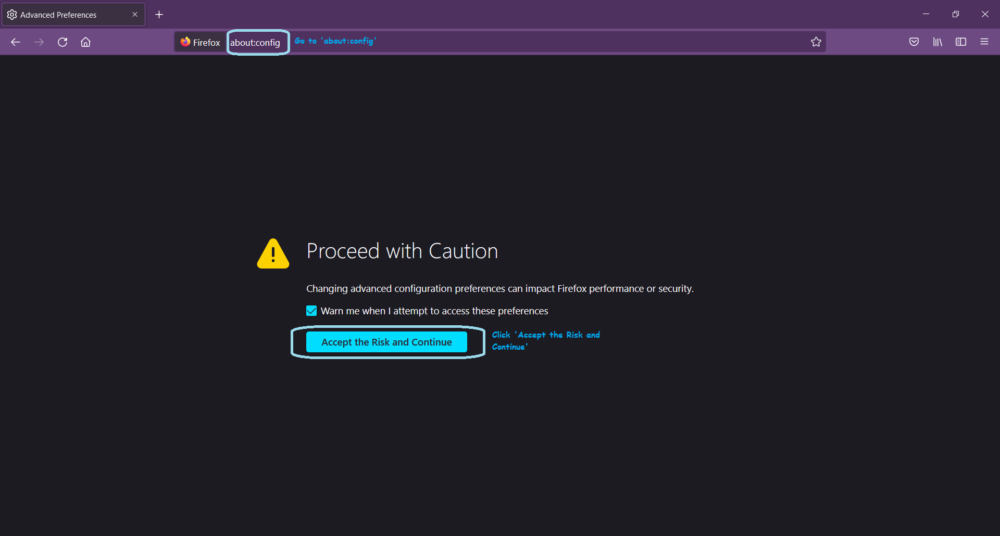
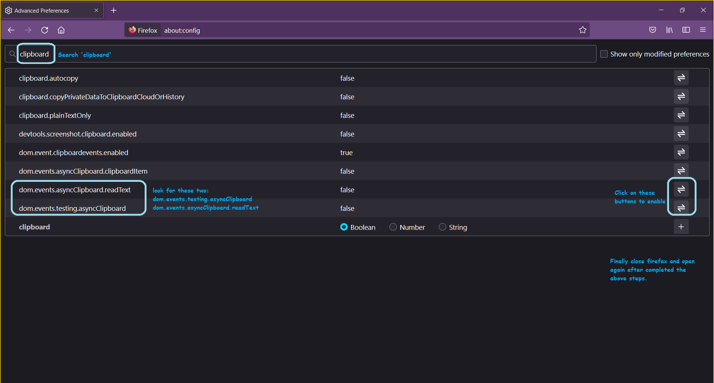
